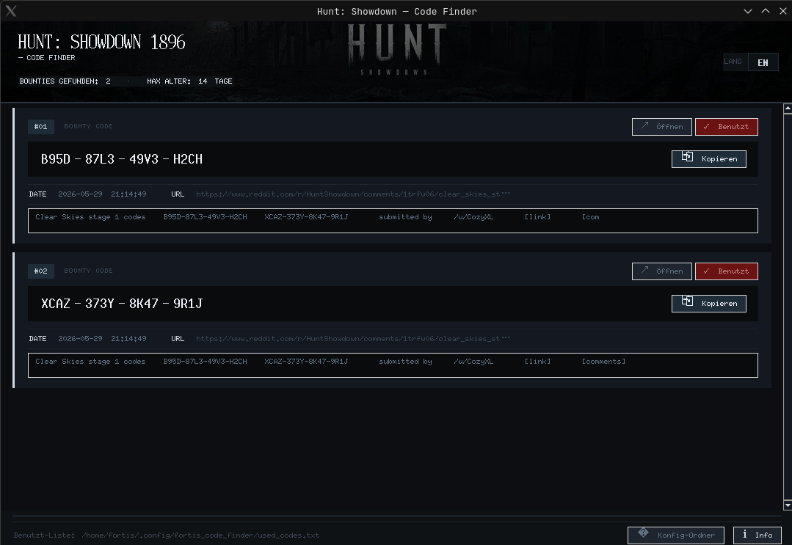

# Screenshot

# Description
This is a code finder for Hunt Showdown.
> Unofficial. No connection to Crytek or Reddit.

---

## ✅ System Requirements

- Windows 10/11 (64-bit)

**No installation required:**  
The EXE is portable – just run it.

for Linux Users -> use the "hunt_codes_gui.py"

---

## 🚀 Getting Started

1. Download `HuntCodeFinder.exe`
2. Double-click to start

On first launch, Windows SmartScreen may warn you (unknown publisher). This is normal for unsigned EXEs.

---

## 🔍 What does the app do?

- Single search run for possible codes (no background service)
- Filter: only content from the **last 14 days**
- Code detection in format:
  - `XXXX-XXXX-XXXX-XXXX`

Each result has buttons:

- **copy** → Code to clipboard
- **open** → Open source in browser
- **used** → Code is saved and ignored in future

---

## 🧾 "Used" List (saved)

When you mark a code as **"Used"**, it is saved in a list and **not shown** on the next start.

**Storage location (Windows):**
- `%APPDATA%\FortisCodeFinder\used_codes.txt`

### Reset / Show again
- Delete `used_codes.txt`, or remove individual lines.

---

## 🧯 Troubleshooting (if the app doesn't start)

If something goes wrong at startup, the app writes a log.

**Log file:**
- `%APPDATA%\FortisCodeFinder\error.log`

If you need help: Copy the contents of `error.log` and post it as an issue.

---

## ⚠️ Notes / Limitations

- The app accesses publicly available content; search sources may have rate limits.
- Found codes are only **pattern matches** – no guarantee that they are valid.
- Depending on internet/source, it may happen that no results are displayed.

---

## 📦 Download

- Releases: Download the latest `HuntCodeFinder.exe` from the **Releases** section.

---

## 🙏 Credits

- Python / Tkinter (foundation for the packaged program)
- Requests / BeautifulSoup / python-dateutil

- Tested by Greenie, Lynara and Grendelwendell

